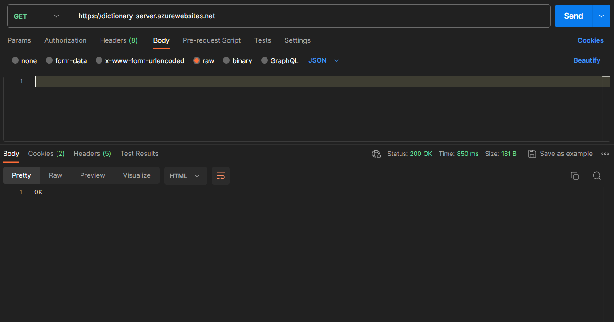
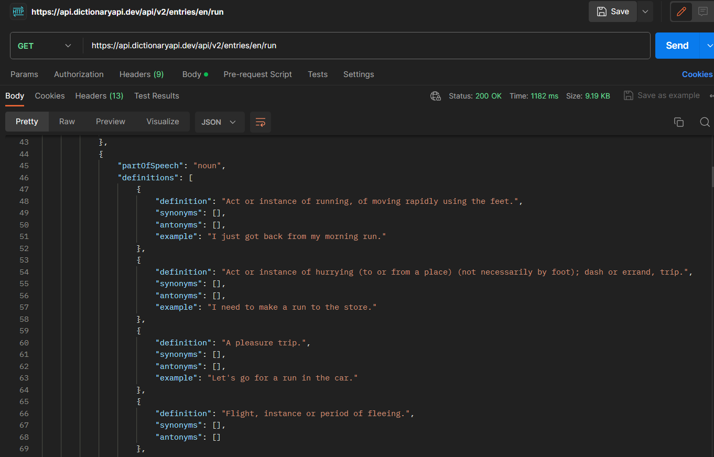

# Dictionary chatbot by Man

Deploy server on Microsoft Azure  
This server created by using ExpressJS

  
Scan this QR Code for becoming friends

## Problem of this application  

1. some word will have many definion object example: run this verb will have many definition in 1 object and it will ruin the server and the server will stop working  
     
   to restart server again we have to use Postman and send request to server and server will restart  
     
    
   from this picture you will see the object definitions[
   {
        "definition": "Act or instance of running, of moving rapidly using the feet.",
        "synonyms": [],
        "antonyms": [],
        "example": "I just got back from my morning run."
   },
   {
        "definition": "Act or instance of hurrying (to or from a place) (not necessarily by foot); dash or errand, trip.",
        "synonyms": [],
        "antonyms": [],
        "example": "I need to make a run to the store."
   },
   {
        "definition": "A pleasure trip.",
        "synonyms": [],
        "antonyms": [],
        "example": "Let's go for a run in the car."
   },
   ]
